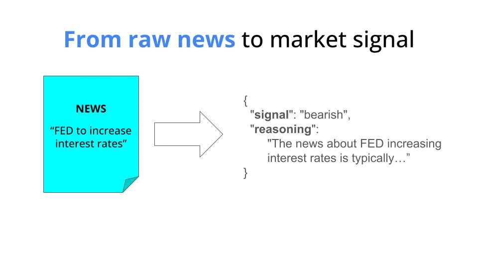

<div align="center">
    <h1>Crypto sentiment with LLMs</h1>
    <h3><i>“In all chaos there is a cosmos, in all disorder a secret order.”</i></h3>
<h4>― Carl Jung</h4>
    
</div>

#### Table of contents
* [The problem](#the-problem)
* [How to run this thing in 5 minutes?](#how-to-run-this-thing-in-5-minutes)
* [Wanna learn more about LLMs and real-time ML?](#wanna-learn-more-about-llms-and-real-time-ml)


## The problem

Say you want to build an ML service to extract crypto market signals from financial news.



The output of such service can be piped into a predictive ML model, together with other predictive features, like real time market prices for all currencies, to come up with the best price prediction possible.

We want to build a Python microservice that

* given a news headline

    ```news = "FED to increase interest rates"```

* outputs a market signal and the reasoning behind this score.
    ```
    {
    "signal": "bearish",
    "reasoning": "The news about FED increasing interest rates is typically bearish for crypto markets for several reasons:\n1. Higher interest rates make borrowing more expensive, reducing liquidity in the market\n2. Higher rates make traditional yield-bearing investments more attractive compared to crypto\n3. Risk assets like cryptocurrencies tend to perform poorly in high interest rate environments\n4. Historically, crypto prices have shown negative correlation with interest rate hikes"
    }
    ```

The signal is a categorial value with values

- `bullish` (positive market impact)
- `neutral` (neutral/unclear impact), or
- `bearish` (negative market impact)

Transforming raw input into a structured output is something LLMs excel at, so it makes sense we give them a try here.

This is what I have implemented in this repo.

## How to run this thing in 5 minutes

### 1. Install `uv`

Install uv on Linux/Mac

```
curl -LsSf https://astral.sh/uv/install.sh | sh
```

or on Windows

```
powershell -ExecutionPolicy ByPass -c "irm https://astral.sh/uv/install.ps1 | iex"
```


### 2. Get your API at anthropic
In this example I am using Claude, so if you want to follow along you need to get your API key.

Alternatively, you could run an open-source LLM like Llama 3.2 using Ollama.

### 3. See it in action
```bash
make run
```

## Wanna build a real time ML system using LLMs?
Join the Real-time ML adventure with me.

No pre-recorded session.
Everything is live.
You and me.
Step by step.
From zero to SYSTEM.

**[👉 Click here to know more](https://realtimeml.carrd.co/)**
